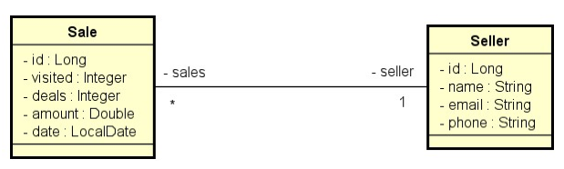

<p>
<h1 align="center">DESAFIO: Consulta vendas</h1>

<a href="()"></a>
[ACESSAR  PROJETO](https://github.com/luizzlcs/desafio-consulta-vendas)


## Funcionalidades


Trata-se de um sistema de vendas (Sale) e vendedores (Seller). Cada venda está para um vendedor, e um vendedor pode ter várias vendas.

* Projeto com Spring Boot com Java e banco de dados H2,



As seguintes consultas foram implementadas:

## Relatório de vendas
1. [IN] O usuário informa, opcionalmente, data inicial, data final e um trecho do nome do vendedor.
2. [OUT] O sistema informa uma listagem paginada contendo id, data, quantia vendida e nome do vendedor, das vendas que se enquadrem nos dados informados.

Informações complementares:
    
* Se a data final não for informada, considera a data atual do sistema.
* Se a data inicial não for informada, considera a data de 1 ano antes da data final.
* Se o nome não for informado, considera o texto vazio.

## Sumário de vendas por vendedor:

1. [IN] O usuário informa, opcionalmente, data inicial, data final.
2. [OUT] O sistema informa uma listagem contendo nome do vendedor e soma de vendas deste vendedor no período informado.

Informações complementares:

* As mesmas do caso de uso Relatório de vendas


## Testes manuais no Postman

* link da collection Postman
abaixo: https://www.getpostman.com/collections/dea7904f994cb87c3d12

* Sumário de vendas por vendedor (teste 1):

GET /sales/summary?minDate=2022-01-01&maxDate=2022-06-30

> Deverá retornar o sumário de vendas por vendedor no período informado:

```
[
    {
        "sellerName": "Anakin",
        "total": 110571.0
    },
    {
        "sellerName": "Logan",
        "total": 83587.0
    },
    {
        "sellerName": "Loki Odinson",
        "total": 150597.0
    },
    {
        "sellerName": "Padme",
        "total": 135902.0
    },
    {
        "sellerName": "Thor Odinson",
        "total": 144896.0
    }
]
```  

- Sumário de vendas por vendedor (teste 2)

    GET /sales/summary
    
    > Deverá retornar o sumário de vendas por vendedor dos últimos 12 meses.

- Relatório de vendas (teste 1)

    GET /sales/report

    > Deverá retornar o relatório de vendas dos últimos 12 meses.

- Relatório de vendas (teste 2)
    GET /sales/report?minDate=2022-05-01&maxDate=2022-05-31&name=odinson

    > Deverá retornar o relatório de vendas do período/vendedor informados:

```

        "content": [
            {
                "id": 9,
                "date": "2022-05-22",
                "amount": 19476.0,
                "sellerName": "Loki Odinson"
            },
            {
                "id": 10,
                "date": "2022-05-18",
                "amount": 20530.0,
                "sellerName": "Thor Odinson"
            },
            {
                "id": 12,
                "date": "2022-05-06",
                "amount": 21753.0,
                "sellerName": "Loki Odinson"
            }
            ],
```


---
### Autor
Sou desenvolvedor fullstack com foco em entregar soluções completas e eficientes, combinando tecnologias modernas como Dart e Flutter para front-end e Java para back-end. Desde 2022, atuo na Ponto Care, onde desenvolvo aplicativos para Android e Web, sempre priorizando inovação, qualidade e a melhor experiência para o usuário.


[](https://www.linkedin.com/in/luizzlcs/)